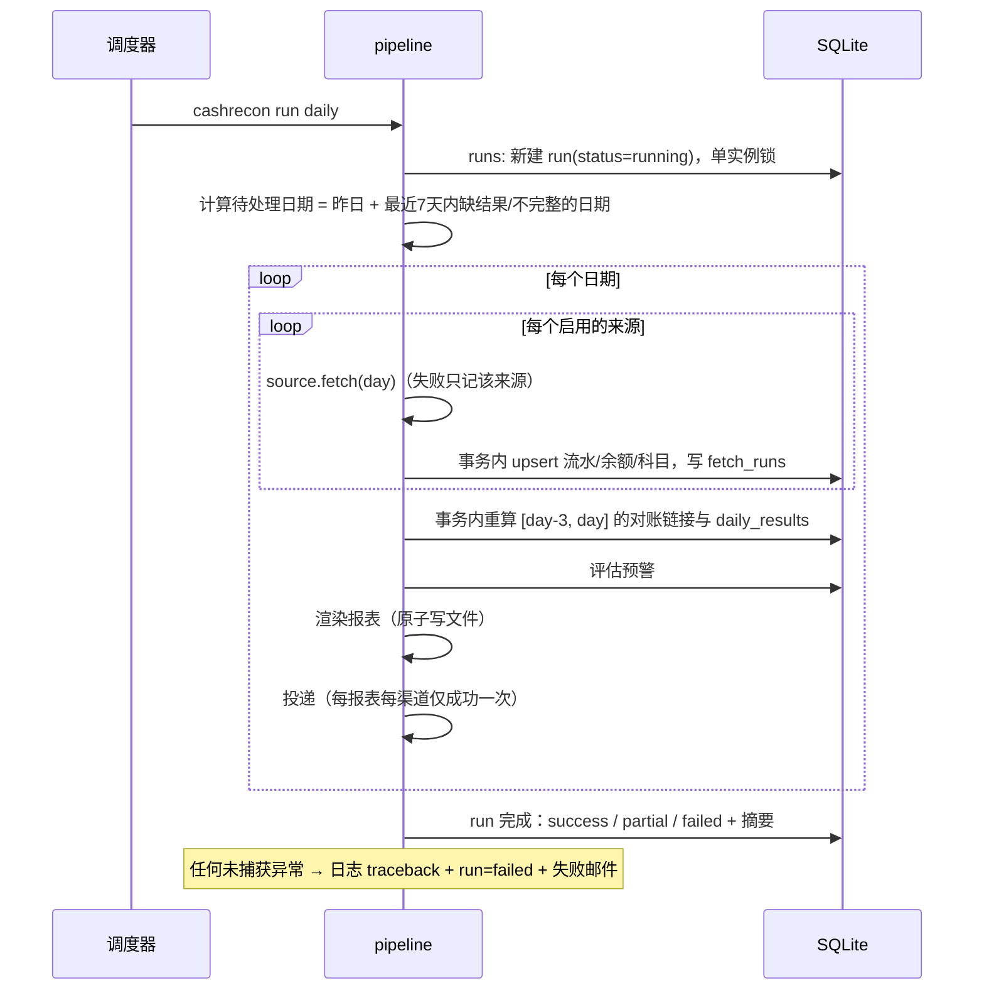

# 02 系统架构设计

版本：v1.0 ｜ 日期：2026-10-01 ｜ 依据：[01 需求规格](01-requirements.md)

## 1. 设计原则

1. **事实与结论分离**：采集只负责把来源数据原样、幂等地落库（事实）；对账、利润、报表都是“事实 + 规则 + 人工结论”的纯函数（结论），随时可重算。
2. **失败必须可见**：每次运行有运行记录、日志文件和最终状态；未捕获的异常也会落盘并发邮件；缺失来源在报表中醒目标注，不补零。
3. **自愈优先于人工补跑**：日任务自动检查最近 7 天，缺日报或数据不完整的日期自动补齐。
4. **只读默认、最小外呼**：上游 SQLite 只读打开；zto-cli 只调用白名单读端点；写入功能独立开关。
5. **平台无关**：纯 Python 标准库为主，路径用 `pathlib`，文件 UTF-8，调度按平台生成。
6. **配置驱动**：网点、账户、来源、规则、阈值、推送全部在部署机私有配置中；代码与仓库不含任何网点信息。

## 2. 总体结构

```mermaid
flowchart LR
  subgraph Sources[数据源]
    ZS[ZT_SUMMARY<br/>中天汇总+科目]:::api
    ZF[ZT_FLOW<br/>中天逐笔]:::mix
    J[JOURNAL<br/>日记账登记/账户/汇总]:::api
    B[BANK_SMS / ICBC / ALIPAY<br/>上游 ledger.sqlite]:::db
    BP[BILL_PROFIT<br/>账单口径]:::api
    M[MANUAL<br/>控制台录入]:::local
  end
  subgraph Core[cashrecon]
    ZC[zto 客户端<br/>主备切换]
    ING[采集 ingest<br/>幂等落库]
    DB[(SQLite<br/>cashrecon.db)]
    ENG[对账引擎<br/>分类/去重/互转/提现/余额/利润]
    RES[日结果 daily_results]
    AL[预警]
    AN[财务分析]
    REP[报表 HTML/JSON/CSV]
    DEL[投递 KB/邮件]
    WEB[本地网页控制台]
    SCH[调度 launchd / 任务计划]
  end
  ZS & J & BP --> ZC --> ING
  ZF & B --> ING
  M --> WEB --> DB
  ING --> DB --> ENG --> RES --> AL & AN --> REP --> DEL
  SCH --> ING
  classDef api fill:#e8f0fe; classDef db fill:#fef7e0; classDef mix fill:#f3e8fd; classDef local fill:#e6f4ea;
```

## 3. 模块划分（`src/cashrecon/`）

| 包 | 职责 | 关键接口 |
| --- | --- | --- |
| `paths` `config` | 数据目录定位（默认 `~/.site-cash-recon`，可用 `CASHRECON_HOME` 覆盖）；加载 `config.toml` + `secrets.env` 并校验 | `Settings` |
| `money` `dates` | 分↔元转换（`Decimal`）、上海时区业务日 | `to_cents()` `fmt_yuan()` |
| `db` | 建表/迁移、连接（WAL、外键）、备份 | `Store` |
| `zto` | zto-cli 客户端：主备切换、超时、业务码校验、端点白名单、请求计数 | `ZtoClient.data(adapter, endpoint, payload)` |
| `sources` | 每个来源一个实现，统一接口 `fetch(day) -> SourceBatch`；只取数与字段映射，不做业务判断 | `Source` 协议、`registry` |
| `engine` | 分类、重复识别、互转/充值/提现匹配、逐账户余额核对、利润、日结果 | `reconcile(store, start, end)` |
| `alerts` | 规则评估、冷却、幂等键 | `evaluate(day)` |
| `analysis` | 规则分析（必有）+ 大模型分析（可选） | `Analyzer` 协议 |
| `reports` | 报表数据组装 + Jinja2 模板渲染 + 内联 SVG 图表 | `build_daily()` `render()` |
| `delivery` | 知识库发布与回读、邮件（agently-cli / SMTP）、投递台账 | `Channel` 协议 |
| `web` | Flask 控制台（默认仅 127.0.0.1） | — |
| `scheduler` | 生成并注册 launchd plist / Windows 计划任务 | `install()` `uninstall()` `status()` |
| `pipeline` | 编排一次运行：采集→对账→预警→报表→投递，运行记录与异常兜底 | `run_job(job, day)` |
| `cli` | 命令行入口 `cashrecon …` | — |

## 4. 一次日任务的执行流程



- 采集与重算分别是独立事务；采集成功而重算失败时，下一次运行会重算，不会出现“数据已入库但永远没有报告”的情况（旧系统 9-29 问题）。
- 18:00 补跑与 12:10 是同一个命令；补跑只处理不完整日期与失败渠道。

## 5. 数据源接口

```python
class Source(Protocol):
    code: str                       # 例：JOURNAL
    def fetch(self, day: date) -> SourceBatch: ...

@dataclass
class SourceBatch:
    source: str
    day: date
    flows: list[FlowRecord]          # 统一流水（金额为分）
    balances: list[BalanceRecord]    # 该来源报告的账户期初/期末
    extras: dict                     # 例：中天科目分项、账单口径分量
    complete: bool                   # 来源是否明确返回了完整数据（分页齐全）
```

来源的启用与实现选择全部来自配置，例如 `ZT_FLOW` 可选 `monitor_db`（读上游库）或 `api`（zto-cli 逐笔接口）；日记账未来可以换成 `csv_import` 实现。

## 6. 部署视图

| 项 | macOS | Windows |
| --- | --- | --- |
| Python | 3.11+（建议 `uv` 管理的独立虚拟环境） | 同左 |
| 数据目录 | `~/.site-cash-recon/` | `%USERPROFILE%\.site-cash-recon\` |
| 私有文件 | `config.toml`、`secrets.env`（0600） | 同左（NTFS 用户私有目录） |
| 数据库 | `data/cashrecon.db`（每日备份到 `backups/`） | 同左 |
| 报表 | `reports/{daily,weekly,monthly}/` | 同左 |
| 日志 | `logs/cashrecon.log`（按天轮转 30 份） | 同左 |
| 调度 | `~/Library/LaunchAgents/com.sitecashrecon.*.plist` | 任务计划程序 `\SiteCashRecon\*`（错过后尽快运行） |
| 控制台 | `cashrecon web` → http://127.0.0.1:8765 | 同左 |
| 邮件 | agently-cli（若已安装）或 SMTP | SMTP 或 agently-cli |

## 7. 安全设计

- 凭据只从 `secrets.env` 或环境变量读取，日志与异常信息中对密钥做掩码。
- zto-cli 端点白名单；写端点不在白名单内，写入功能（FR-11）另走独立模块与确认流程。
- 报表默认 `internal` 可见；不出现完整卡号、手机号。
- 控制台只监听 127.0.0.1；开放局域网需配置口令。
- 公开仓库防泄漏：`scripts/leakcheck.py` 在 pre-commit 与 CI 中扫描通用密钥/卡号/手机号/内网 IP 模式，本机另读取私有拒绝词表（网点名、人名、邮箱等）。

## 8. 关键技术决策（ADR 摘要）

| # | 决策 | 理由 |
| --- | --- | --- |
| ADR-1 | Python 3.11+，SQLite，Jinja2，Flask + waitress | 跨平台、零服务依赖、与现有生态一致；waitress 可在 Windows 稳定运行 |
| ADR-2 | 金额存分（INTEGER） | 杜绝浮点误差；上游 REAL 统一按两位小数四舍五入转换 |
| ADR-3 | 中天利润以门户“流水汇总科目分项”为准 | 门户已给出完整科目体系且与余额等式闭合；逐笔流水仅用于匹配充值/提现 |
| ADR-4 | 结论可重算 | 规则调整或人工结论后重跑即可，避免“状态漂移” |
| ADR-5 | 本地网页控制台而非桌面程序 | Mac/Windows 通用，无需打包 GUI |
| ADR-6 | 数据目录在用户主目录 | 两平台一致；便于备份与迁移 |
